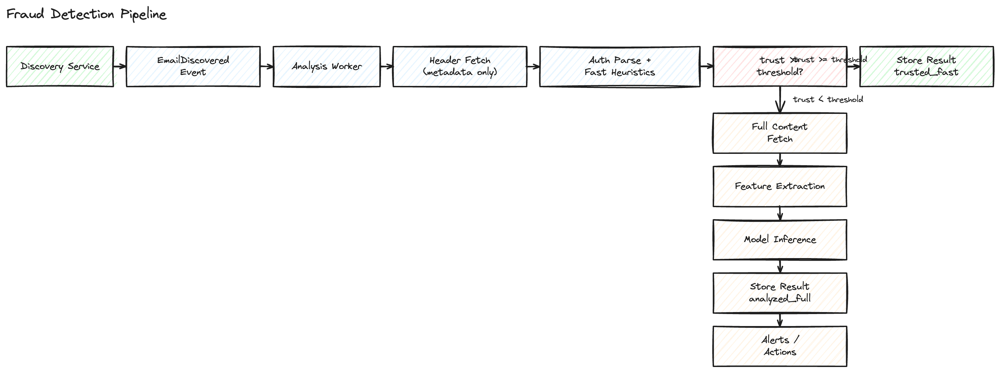

# Fraud Detection Plan

This document defines the email fraud detection pipeline that follows discovery. It focuses on a fast header stage and a full content stage, with clear routing, data boundaries, and edge case handling.

## Goals
- Detect fraudulent or suspicious emails at scale with low latency and high precision.
- Minimize cost by using a fast header based stage to gate expensive content analysis.
- Preserve the zero copy principle where possible and limit full content retention.
- Provide explainable results (reason codes and model versions).

## Non-Goals
- Building a user interface for analysts.
- Real time response to inbound email delivery (this is post delivery detection).

## High-Level Flow
- Discovery emits EmailDiscovered events.
- Analysis workers fetch headers, compute a trust score, and decide:
  - trusted_fast: store result and optionally sample for audit.
  - analysis_requested: fetch full content and run ML plus advanced rules.
- Results are stored and published downstream for alerts or remediation.

## Pipeline Stages

### Stage 0: Ingestion
- Input: EmailDiscovered event with message_id, user_id, tenant_id, provider, received_at, fingerprint.
- Idempotency key: message_id (or fingerprint when message_id is missing).
- Duplicate events are ignored after a stored decision.

### Stage 1: Fast Header Analysis
- Fetch headers only (no body).
- Parse Authentication-Results or ARC-Authentication-Results.
- Extract from, reply-to, return-path, and alignment signals.
- Compute trust_score and reason codes:
  - dmarc_pass, dmarc_fail, dmarc_none
  - spf_pass or spf_fail
  - dkim_pass or dkim_fail
  - reply_to_mismatch
  - from_domain_new_for_tenant
  - lookalike_domain
- Route decision:
  - trust_score >= threshold => trusted_fast
  - trust_score < threshold => analysis_requested
  - optional sampling of trusted_fast for drift detection

### Stage 2: Full Content Analysis
- Fetch full content only when needed.
- Extract features:
  - URLs and domains, attachment types, language, body text, subject.
  - Header anomalies and sender history features from Stage 1.
- Run model inference (text model plus structured features).
- Produce fraud_score, label, and reason codes.
- Store results and emit EmailAnalyzed event.

### Stage 3: Decisioning and Actions
- Apply tenant specific policies and thresholds.
- Actions can include alert, quarantine, or ticket creation.

## Data Storage
- analysis_results table:
  - message_id, user_id, tenant_id, fraud_score, label, stage, reasons
  - model_version, feature_version, evaluated_at
- Optional: raw email storage in object storage with TTL for replay and auditing.

## Model Strategy
- Phase 1: rules plus classical ML over structured features.
- Phase 2: fine tuned text model (DistilBERT or BERT).
- Phase 3: ensemble of text score and structured score.
- Record model versions and thresholds used in each decision.

## Edge Cases and Handling

### Authentication and Headers
- Forwarded mail: SPF may fail. Check ARC-Authentication-Results and do not auto fail on SPF alone.
- Mailing lists: DKIM breaks due to body changes. Use DMARC and list specific heuristics.
- Multiple Authentication-Results headers: use the last header (closest to receiver).
- DMARC none: treat as low confidence, not as fail.
- Missing headers: fall back to best available signals and reduce trust_score.

### Identity and Alignment
- From vs reply-to mismatch: treat as risk, but allow for known vendors and allowlists.
- Lookalike domains: apply string similarity checks for high value domains.
- New sender or new domain for tenant: increase risk, not a hard block.

### Content and Parsing
- Large or malformed messages: cap size and log partial parse.
- Encoded or HTML only content: normalize to text, track extraction failures.
- Non Latin languages: avoid false positives by language detection and per language thresholds.
- Inline images or tracking pixels: do not treat as attachments unless file types match.

### Provider and API Issues
- Rate limits or transient errors: retry with backoff; requeue without losing events.
- Message deleted before fetch: mark as not_found and do not retry forever.
- Inconsistent message IDs: use fingerprint fallback if needed.

### Queue and Idempotency
- Duplicates or out of order events: idempotent writes keyed by message_id.
- Long backlog: degrade by raising the fast stage threshold temporarily to preserve throughput.

### ML and Risk Management
- Compromised accounts with auth pass: rely on content analysis and behavior signals.
- Model drift: sample trusted_fast emails for periodic full analysis.
- Adversarial text: use URL features and header anomalies as a backstop.

## Implementation Plan
1. Define events and result schema, including reason codes and model_version.
2. Add header only fetch in provider clients.
3. Implement Stage 1 trust scoring and routing logic.
4. Implement Stage 2 feature extraction (without model first).
5. Integrate model service and record inference outputs.
6. Add sampling, allowlists, and tenant thresholds.
7. Add metrics and alerting for latency, backlog, and false positives.

## Testing Plan
- Unit tests for header parsing and trust scoring.
- Replay tests with known phishing and clean datasets.
- Load test with high volume EmailDiscovered events.
- Drift monitoring with weekly sampled analysis on trusted_fast.
